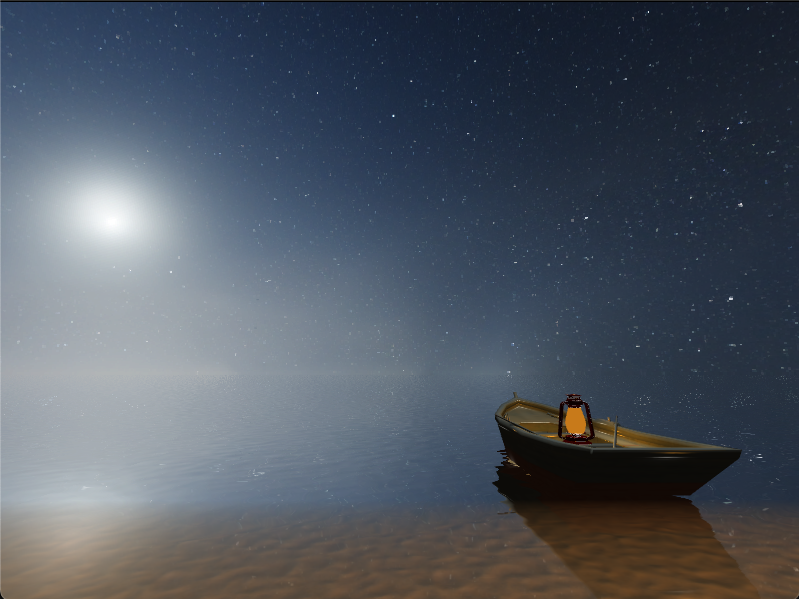

    
    

## Project
An OpenGL renderer for rippling water.

This project builds off of the [LearnOpenGL](https://learnopengl.com/) series and [ThinMatrix's tutorial](https://www.youtube.com/watch?v=HusvGeEDU_U&list=PLRIWtICgwaX23jiqVByUs0bqhnalNTNZh&ab_channel=ThinMatrix) on rendering water in OpenGL. It serves as my introduction to OpenGL.

Features include:

- 3D Model, texture, and normal-map loading with [assimp](https://github.com/assimp/assimp/tree/master)
- Interactive view of scene that can be controlled with WASD keys and cursor
- API for placing, scaling, and rotating objects
- Point lights and directional lights
- Skyboxes
- Watery surfaces with reflection, refraction, ripples via dudv maps, the Fresnel effect, and transparency in shallow regions of water.

I developed this project on an x86 Mac, so the build system will probably favor people who are using those machines.

## Build

Clone repository:
`git clone --recurse-submodule https://github.com/rshiv2/glWater`

This project uses [assimp](https://github.com/assimp/assimp/tree/master) to load 3D models. 

To compile assimp:
`cd external/assimp`
`cmake CMakeLists.txt && make -j{<number of cores}`

On linux, you can get the number of cores with `nproc`, on Mac, you can get it with `sysctl -n hw.ncpu`.

## Todos
- [ ] Object picking and placing. It's currently _really_ tedious to design scenes. My process was to nudge an object, compile, see the results, then repeat.
- [ ] Fix weird artifacts that occur at interface of water and terrain.
- [ ] Introduce bloom and deferred shading. I want to add lots more light sources, and make them look a bit more realistic.
- [ ] Speed up model loading. I need to profile this part of the code in order to be sure, but my guess is that assimp is taking a long time to load in 3D models.
